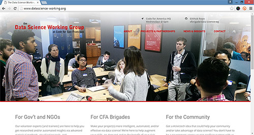

## Thanks for stopping by!

The **Data Science Working Group’s** purpose is to efficiently assess, inspire, and tackle Code for San Francisco’s data science needs, as well as to help the City with its data science needs whenever appropriate. Our practicing and aspiring data scientists are available to:  

+ develop data science-centric solutions to social good problems;
+ assess/inspire the possibility of data science components in other projects;
+ provide resources to help produce those components;
+ provide a learning environment for ourselves and others to learn more practical data science.

In pursuing the above, we humbly hope that CfSF's dedicated project groups come to consider us an integral and synergistic resource for the brigade at large.

### Administration

Team Leads: [Jude Calvillo](http://linkd.in/1BGeytb) and [Sanat Moningi](http://bit.ly/1PFurlp)  
Lead Data Scientist: [Matthew Pancia](http://bit.ly/1PFuA8k)  
Website: [datascience.codeforsanfrancisco.org](http://datascience.codeforsanfrancisco.org)  
Wiki (resources): [DSWG Wiki >>](https://github.com/sfbrigade/data-science-wg/wiki)  

### Current Initiatives

Here's what we're currently working on, mostly with gov't/org partners, but as mentioned above, we're eager to work with -or inspire- dedicated project groups.

+ [U.S. Dept. of Transportation Hazmat Incident Prediction and Anomaly Detection >>](https://github.com/bayeshack2016/cfsf-datasci_dot-hazmat)
+ [City of SF Planning: Development Pipeline Report >>](https://github.com/thfield/sf-planning-pipeline-report)
+ [City of SF 311 Case Data Analysis >>](https://github.com/sfbrigade/data-science-wg/tree/master/projects-in-this-repo/SF_311_Data-Analysis)
+ [Interactive visualization of SF's building emissions and energy use >>](https://github.com/smoningi/SF-Environment-Benchmark)
+ [City of SF Budget Visualization >>](https://github.com/sameerank/sf-budget-visualization)
+ [Predicting Relative Risk of Fire in SF's Buildings >>](#)

### Recent Past Initiatives

+ [ParkSafe GIS Coordinate Realignment (w/street paths; for parking applications) >>](https://github.com/sfbrigade/data-science-wg/tree/master/projects-in-this-repo/Park-Safe_GIS-Solution)
    - Status = Completed
+ [SF Hip Data Aggregation (for future liquor license visualization) >>](https://github.com/davidrs/sfhip-map)
    - Status = Completed
+ [SF's budget allocations: Measuring social impact >>](https://github.com/RocioSNg/SF_brigade_impact_gov)
    - Status = On hold until further notice

### Recent Happenings

Code for SF's Data Science Working Group continues to make great strides in its local impact and apparent viability. Since our last repo update, our young group won its government challenge at one of the nation's premier data science-focused hackathons (Bayes Hack, 2016). It also recently presented its numerous projects to local hackers and potential gov't/org partners at Code for SF's Demo Night, as well as presented its 311 analysis findings directly to City officials.  

...and now we've got a website(!), to better convey the full scope of our identity, happenings, and means of engagement.  

We invite you to visit our new website, at [datascience.codeforsanfrancisco.org](http://datascience.codeforsanfrancisco.org/), to learn more about the above! 

