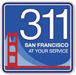
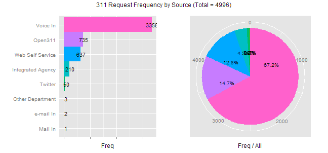
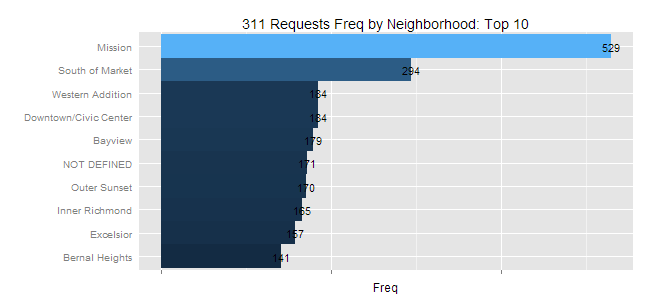
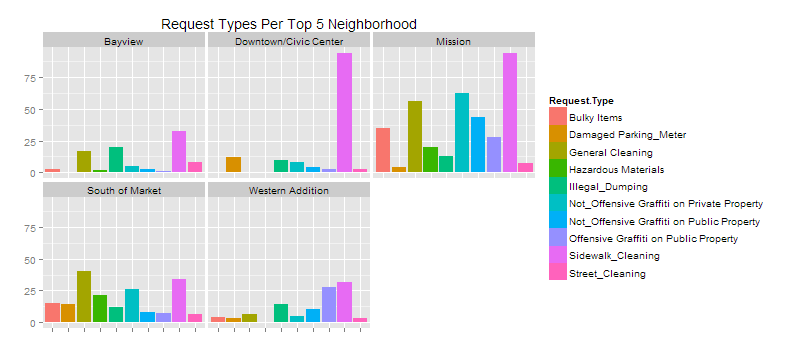

  

## 311 Case Data: Exploratory Analyses

[SF OpenData](https://data.sfgov.org/) provides a real-time record and API for [311 cases completed and in progress](https://data.sfgov.org/City-Infrastructure/Case-Data-from-San-Francisco-311-SF311-/vw6y-z8j6). The Data Science Working Group at Code for San Francisco looks to perform exploratory statistical analyses on this data to find whether there are any strategically and/or politically interesting characteristics of San Francisco's public agencies and/or the publics they serve.  

**Responsible DSWG Teammates**
+ [Matthew Pancia](http://bit.ly/1PFuA8k)
+ [Elena Palesis](http://bit.ly/1mgjXl4)
+ [Yiwen Yu](http://bit.ly/1mgkqDE)
+ [Jude Calvillo](http://linkd.in/1BGeytb)
+ [Jeff Lam](http://bit.ly/1Pm9SLJ)
+ [Catherine Zhang](http://bit.ly/1WXteM8)
+ [Rocio Ng](http://bit.ly/1WXtj2v)
+ [Abhiram Chintangal](http://bit.ly/1WXtpHr)

### Tests to be Performed
These have yet to be determined, but some analyses we're currently considering include:

+ Looking for statistically significant differences in...
    - Resolution times by agency (overall and per request type)
    - Resolution times by neighborhood served (overall and per request type)
    - Resolution times by Supervisor/District (overall and per request type)
    - Request types per neighborhood
+ Correlations between...
    - Resolution times and call frequency
    
### Quickies
Just some basic descriptive stats and plots until the team begins its real statistical analyses. *Please note, all of the below draw from a 5,000 record sample*:

  

 

### Resolution Time Explorations (in Hours)
We'll be adding plots shortly. These are just some summaries to inspire the DSWG's more advanced/inferential statistics.

#### Top 10 Request Types...
**--- By Shortest Mean Resolution Time (across all neighborhoods) ---**

|Request.Type                                             | Mean.Resolve|
|:--------------------------------------------------------|------------:|
|Sign Repair - Loose                                      |         0.03|
|mta - residential_parking_permit - request_for_service   |         0.04|
|tt_collector - tt_collector - mailing_request            |         0.23|
|county_clerk - county_clerk - request_for_service        |         0.51|
|puc - water - customer_callback                          |         0.79|
|mta - bicycle - request_for_service                      |         1.20|
|Construction Zone Tow-away Permits for Proven Managment  |         1.68|
|Litter_Receptacle_Request_New_Removal                    |         1.69|
|homeless_concerns - homeless_other - request_for_service |         2.06|
|puc - water - request_for_service                        |         2.12|

**--- By Longest Mean Resolution Time (across all neighborhoods) ---**

|Request.Type                                | Mean.Resolve|
|:-------------------------------------------|------------:|
|dpw - bsm - followup_request                |     27208.90|
|Public_Stairway_Defect                      |     25823.03|
|Streetlight - Other_Request_New_Streetlight |     18549.16|
|Utility Lines/Wires                         |     17381.97|
|rpd - rpd_other - request_for_service       |     11650.02|
|SFHA Priority - Preventive                  |     10512.38|
|sfpd - sfpd - request_for_service           |     10336.51|
|puc - puco - complaint                      |      8905.67|
|dtis - dtis - request_for_service           |      8573.08|
|Streetlight - Other_Request_Light_Shield    |      6312.14|

#### Top 10 Neighborhoods...
**--- By Shortest Mean Resolution Time (across all request types) ---**

|Neighborhood          | Mean.Resolve|
|:---------------------|------------:|
|McLaren Park          |         2.82|
|Candlestick Point SRA |         6.30|
|Parkmerced            |        12.40|
|Merced Manor          |        15.88|
|Sherwood Forest       |        24.13|
|Peralta Heights       |        47.58|
|Alamo Square          |        47.78|
|Little Hollywood      |        48.76|
|Lake Street           |        55.12|
|Balboa Terrace        |        78.03|

**--- By Longest Mean Resolution Time (across all request types) ---**

|Neighborhood        | Mean.Resolve|
|:-------------------|------------:|
|Holly Park          |      2540.00|
|Cole Valley         |      2435.79|
|Cayuga              |      2343.87|
|Anza Vista          |      1736.16|
|Presidio Terrace    |      1541.12|
|Cow Hollow          |      1462.26|
|Glen Park           |      1394.10|
|West of Twin Peaks  |       948.83|
|Northern Waterfront |       887.75|
|Castro/Upper Market |       875.78|

