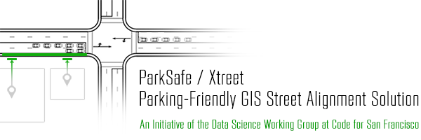
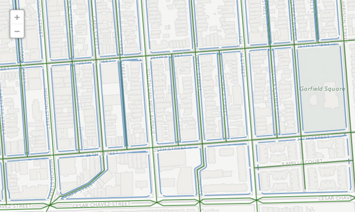

## Solving a Common GIS Problem: Assigning Curbs...

Many cities have shapefiles that reflect their street maps, and presumably every city has the GIS coordinates of their building addresses, ...but what about that important piece of public real estate in between?

*CURBS* can pose a serious challenge to civic hacking applications meant to better manage public resources like parking space. 

#### Why?

Curb addresses that could identify parking space locations/intervals don't necessarily exist, particularly in San Francisco. Indeed, GIS coordinates of building addresses usually lie at the centers of buildings of varying depths from their street fronts. What's more, shapefiles for streets actually represent the centers of their vectors (i.e. they're just lines of varying width).  

And without being able to identify curbs, their intervals, and their sides of the street, one cannot, for example, apply a city's parking rules correctly (e.g. parking days + times per side/segment of street).

#### The Solution: Overview

Upon consulting the [Data Science Working Group](http://bit.ly/1KJeSO2), ParkSafe began working with our Lead Data Scientist, [Matt Pancia](http://bit.ly/1PFuA8k), to come up with a solution. This solution essentially entails dragging building address coordinatees toward their nearest street, creating line segments that are some standardized distance from one side of that street's vector, and aligning those segments along the street, even as it curves.

A better description is soon to come.

**Responsible DSWG Teammates**
+ [Matthew Pancia, Ph.D.](http://bit.ly/1PFuA8k)

**ParkSafe Team**
+ [Sergey Litvinenko](http://bit.ly/1ouLIrN)
+ [Patrick Stern](http://bit.ly/1ouKZqA)

**Data Sources Used**
+ Coming soon

#### Status: As of Feb. 23, 2016
+ Matt has already overcome the fundamental challenge of creating curbs.
+ Matt recently fixed a small problem with inappropriate line segments within curbs, and now this solution is much more accurate.
+ Matt is now moving to assigning street sides to segments.

#### Sample
Below, you'll find a screen grab of the latest version of this solution. Click on it ([or click here](http://bit.ly/1KJeorb)) to view it larger and more interactively at CartoDB.

