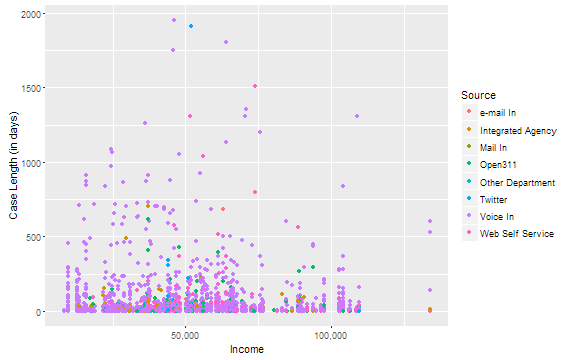
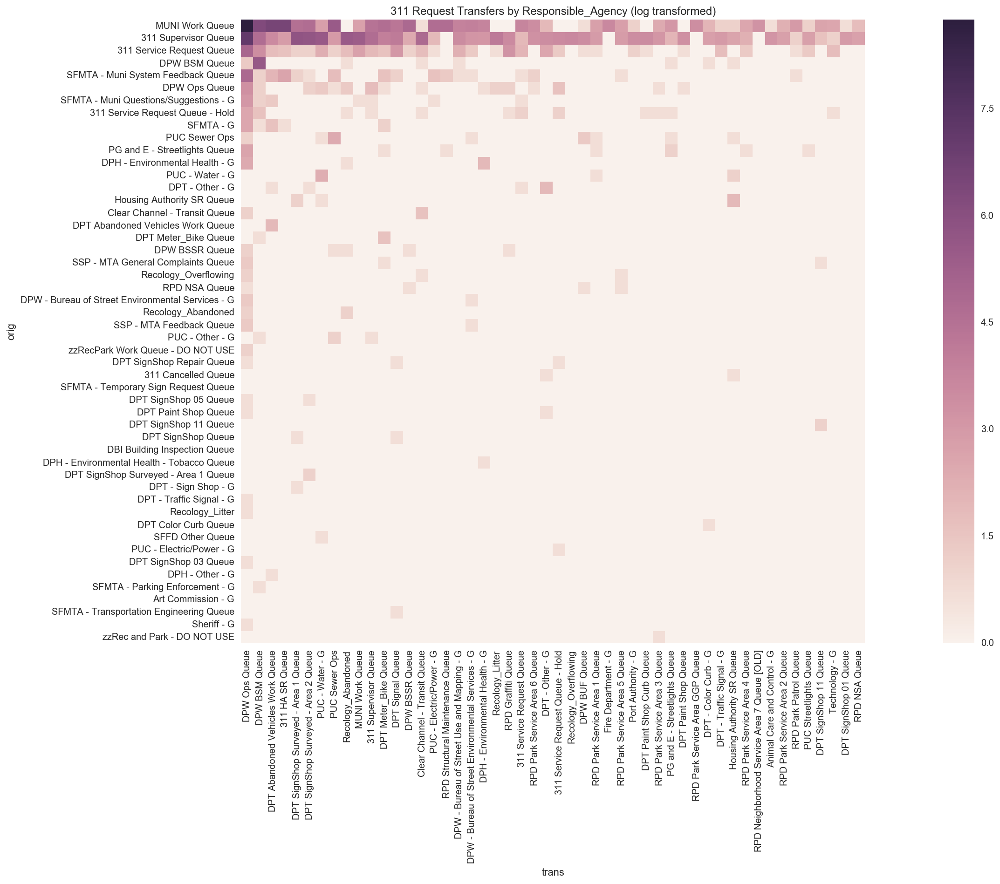

#Funky Numbers

_What happens when you cross civic hacking with data science? The Data Science Working Group (DSWG) of Code for San Francisco has been experimenting with this concept for 8 months. While open source tools for data science are improving all the time, it's still beyond the skillset of many public agencies and nonprofits. Open data does not interpret itself. The DSWG offers their expertise as a resource for any group looking to use data science for the public good.This blog is the first in a series exploring their projects._

SF is not exactly famous for it’s sparkling clean streets. The city’s 311 system receives well over 1,000 requests on a normal day. All those sidewalk cleaning, dumped trash, and graffiti requests generate a ton of data. That data offers insights into how the city handles these issues as well as potential areas for improvement.

San Francisco publishes all 311 case records in real-time on their data portal. Anyone can access this information and perform some basic analyses and visualizations in the portal. The DSWG had two main interests in exploring the 311 data set: equity concerns and operational issues. 


##Equity Concerns

Are there any disparities in how the city responds to requests from less advantaged parts of San Francisco? The DSWG conducted constructed several inquiries to explore this topic. Does the city take longer to respond to 311 requests from poorer residents? What is the distribution of requests among richer and poorer neighborhoods?

While the open 311 data set includes extensive detail on each request, it does not say anything about the income of a reporting party or their home address. The next best data set for examining relationships between 311 requests and income is the census tract level per capita information from the American Community Survey (2014, 5 year estimates). The ACS income data make it possible to test correlations in R down to the neighborhood level.

For example, the first equity concern examined was whether the time taken to resolve a request (caselength) predicts the request location’s median income. If long caselengths are correlated with low income request locations, that would suggest the city taking longer to respond in poorer neighborhoods. Loading the 311 data set sample & the ACS data into an R database (free open source software) makes it possible to examine these issues with precision.

For the full methodology of this analysis, head over to the [project's github repo](https://github.com/sfbrigade/data-science-wg/blob/master/projects-in-this-repo/SF_311_Data-Analysis/README.md). This is the TL;DR version. If you ask R to fit a regression model to the income and caselength data the output shows a p value of 0.705. This p value indicates there is a very high probability caselength is not relevant to income, and therefore can’t be used to predict income([here’s a good intro to interpreting R outputs](http://blog.yhat.com/posts/r-lm-summary.html)). The general p value threshold for using a correlation is .05 or less.

```
## 
## Call:
## lm(formula = pc_inc2014 ~ caselength, data = income)
## 
## Residuals:
##    Min     1Q Median     3Q    Max 
## -41432 -16024  -2958  14219  84966 
## 
## Coefficients:
##               Estimate Std. Error t value Pr(>|t|)    
## (Intercept)  4.967e+04  3.548e+02 139.983   <2e-16 ***
## caselength  -4.577e-02  1.210e-01  -0.378    0.705    
## ---
## Signif. codes:  0 '***' 0.001 '**' 0.01 '*' 0.05 '.' 0.1 ' ' 1
## 
## Residual standard error: 23690 on 4760 degrees of freedom
##   (222 observations deleted due to missingness)
## Multiple R-squared:  3.008e-05,	Adjusted R-squared:  -0.00018 
## F-statistic: 0.1432 on 1 and 4760 DF,  p-value: 0.7052
```

Using the same technique, it is possible to confirm that the source of a request is also not correlated with income. The city responds to 311 requests in roughly the same amount of time to whether they are made by phone, email, twitter, open311, online, by an integrated agency, or by another agency. 

The lack of any trend line in the scatterplot below reflects both of these conclusions.



##Neighborhood
{what was the process or prompt in R that returns the “multiple r squared (i.e. variance explained): 0.74149”

```
## [1] "Multiple R-squared (i.e. variance explained): 0.74149"
```


##Category
{what was learned from showing certain categories are correlated with income?]

##Operational Concerns

In March of 2016, the DSWG presented their early work with 311 data at CodeAcross in San Francisco. That presentation led to conversations with the City’s Chief Data Officer, Joy Bonaguro, about exploring transfers of cases among city agencies. The city was interested in better understanding what cases are most likely to be transferred to optimize their management of 311 cases.

{Still not sure what the city was aiming to improving with this inquiry. Makes it hard to decide what a reader would find interesting about these.}

Analyzing case transfers posed a challenge because the case number of the transferred request were contained in noisy “status notes.” DSWG's Matt Mollison used Natural Language Processing to accurately identify those case numbers. Once the data was cleaned up, it was possible to generate a heat map showing where requests are often transferred from and what agency they are transferred to.



More recently, the DSWG has used Microsoft Power DBI (thanks to credits made available our hack night sponsor Microsoft), the DSWG was able to visualize the case transfer data more intuitively.

{insert MSFT DBI Case Transfers.png]

The bulk of transferred cases originate in the Muni Work Que and 311 Supervisor Que. Both of those cases are mostly transferred to the DPW Ops Que. {What on earth does the Muni Work Que have to do with DPW?}.

The DSWG has generated several new dashboards for the 311 data using Microsoft Power DBI and posted them online [here](http://datascience.codeforsanfrancisco.org/311-transferred-case-interactive-exploration/). These dashboards allow you to segment and explore the data just by clicking on categories. These visualizations explore a sample of all transferred cases with individual dashboards looking at Origin vs Destingation, MUNI Feedback, Graffiti, and General Requests.
