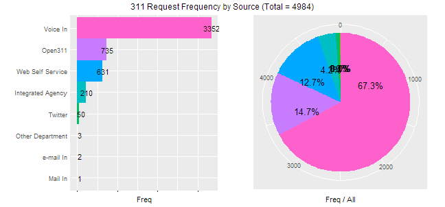
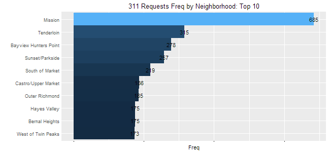
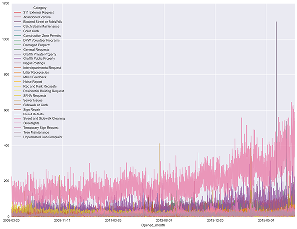

  

## 311 Case Data: Data Analysis

[SF OpenData](https://data.sfgov.org/) provides a real-time record and API for [311 cases completed and in progress](https://data.sfgov.org/City-Infrastructure/Case-Data-from-San-Francisco-311-SF311-/vw6y-z8j6). The Data Science Working Group at Code for San Francisco looks to perform exploratory statistical analyses on this data to see whether it might posses strategically and/or politically interesting characteristics, which we will later confirm -via inferential statistics- and report to relevant stakeholders (e.g. San Francisco's public agencies and/or the publics they serve).  

**Responsible DSWG Teammates**
+ [Matthew Pancia, Ph.D.](http://bit.ly/1PFuA8k)
+ [Elena Palesis](http://bit.ly/1mgjXl4)
+ [Jude Calvillo (Project Lead)](http://linkd.in/1BGeytb)
+ [Jeff Lam](http://bit.ly/1Pm9SLJ)
+ [Matthew Mollison, Ph.D.](http://bit.ly/1PPZXSa)
+ [Hannah Burak](http://bit.ly/1U7D13N)

### Current Status: March 10, 2016

We recently got to share some of our more interesting findings and visualizations at [Code for America's upcoming CodeAcross in San Francisco (March 5, 2016)](https://www.codeforamerica.org/events/codeacross-2016/). Thereafter, we had some great discussions with the City's Chief Data Officer, Joy Bonaguro, wherein we learned about some things we could do to hone our accuracy and utility. Thus, we've since updated our Census profiling to the tract level and matched our neighborhoods to those more commonly used in SF OpenData.  

*Please Note: This project's README and directory will substantially change in the coming week, as we begin to publicly display our inferential statistics and lay the groundwork for our final report.  

### Statistical Tests to be Performed

The tests we're currently tackling include:

+ Income correlates / significant diffs?
+ Resolution time (by agency, overall, neighborhood, income, etc)?
+ C.Neighborhoods per request type?
+ Ethnic correlates / significant diffs?
+ Significant diffs in request types by source?
+ Seasonality to request types?
+ Interaction between call frequency and resolution time, per request type and/or per responsible agency?  
    
### Exploratory Quickies
These are just some early descriptive plots, until the team begins systematically tackling the statistical analyses mentioned above.   

*Please note, all of the below draw from a 5,000 record sample*:

### Similarity of Request Type Distributions (K-L Divergence)
The graph below, produced by Matt Pancia, clusters neighborhoods according to the similarity of their request type distributions, as reflected by their [Kullback–Leibler divergence/weight](https://en.wikipedia.org/wiki/Kullback%E2%80%93Leibler_divergence).  

  

### Time-Lapse Heatmap of 311 Requests for Sidewalk and Street Cleaning
The heatmap linked to below, by Jeff Lam, geographically reflects the number of 311 requests for sidewalk and street cleaning over time. It was produced by Jeffrey Lam and will help inform our impending investigations over seasonality to request types.

  

### Daily Counts of 311 Cases by Category
This plot, by Matt Mollison, shows the total number of 311 cases by request Category (a higher order grouping), per day since 2008. It was drawn from the entire dataset (vs. a sample).

### Resolution Time Exploration (in Hours)
We'll be adding plots later. These are just some summaries to inspire the DSWG's more advanced/inferential statistics.

#### Top 10 Request Types...
**--- By Shortest Median Resolution Time (across all neighborhoods) ---**

|Request.Type                                             | Median.Resolve|
|:--------------------------------------------------------|--------------:|
|Sign Repair - Loose                                      |           0.03|
|mta - residential_parking_permit - request_for_service   |           0.04|
|mta - parking_enforcement - request_for_service          |           0.18|
|tt_collector - tt_collector - mailing_request            |           0.23|
|puc - water - request_for_service                        |           0.47|
|puc - water - customer_callback                          |           0.79|
|Water_leak                                               |           1.09|
|mta - bicycle - request_for_service                      |           1.20|
|Litter_Receptacle_Request_New_Removal                    |           1.69|
|homeless_concerns - homeless_other - request_for_service |           2.06|

**--- By Longest Median Resolution Time (across all neighborhoods) ---**

|Request.Type                                | Median.Resolve|
|:-------------------------------------------|--------------:|
|dpw - bsm - followup_request                |       27208.90|
|Public_Stairway_Defect                      |       25823.03|
|Streetlight - Other_Request_New_Streetlight |       18549.16|
|Utility Lines/Wires                         |       17381.97|
|rpd - rpd_other - request_for_service       |       11650.02|
|sfpd - sfpd - request_for_service           |       10336.51|
|puc - puco - complaint                      |        8905.67|
|dtis - dtis - request_for_service           |        6662.18|
|Streetlight - Other_Request_Light_Shield    |        6312.14|
|Building - Illegal_Guest_Room_Conversions   |        6300.25|

#### Top 10 C.Neighborhoods...
**--- By Shortest Median Resolution Time (across all request types) ---**

|C.Neighborhood    | Median.Resolve|
|:-----------------|--------------:|
|McLaren Park      |           7.25|
|Lakeshore         |          21.61|
|Lincoln Park      |          22.63|
|South of Market   |          39.49|
|Tenderloin        |          45.69|
|Mission           |          47.25|
|Nob Hill          |          47.83|
|Hayes Valley      |          51.64|
|Lone Mountain/USF |          53.18|
|North Beach       |          53.63|

**--- By Longest Median Resolution Time (across all request types) ---**

|C.Neighborhood   | Median.Resolve|
|:----------------|--------------:|
|Potrero Hill     |         170.34|
|Pacific Heights  |         138.16|
|Treasure Island  |         133.12|
|Glen Park        |         132.21|
|Seacliff         |         124.91|
|Inner Richmond   |         120.26|
|Presidio Heights |         113.30|
|Mission Bay      |         109.09|
|Golden Gate Park |         102.84|
|Inner Sunset     |         102.82|

