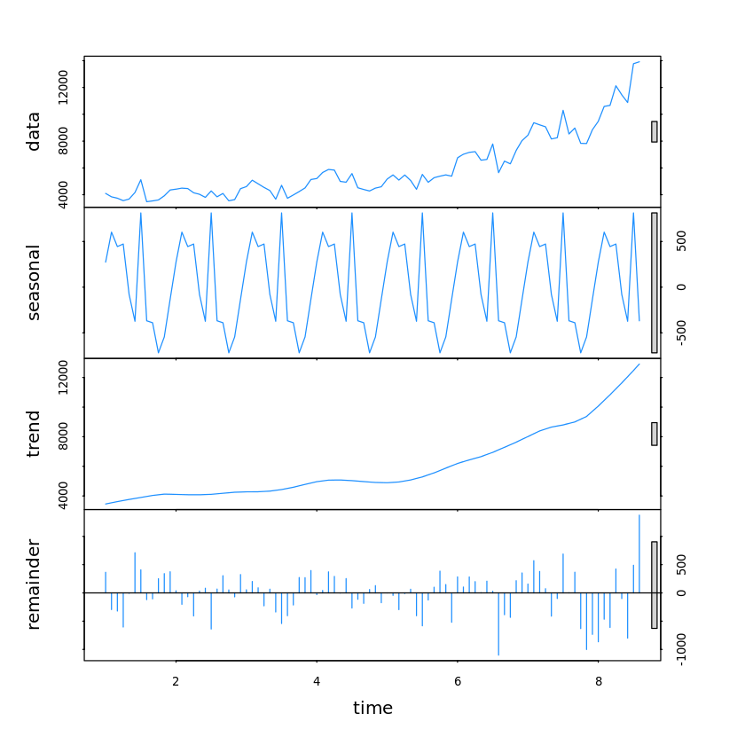

  

## 311 Case Data: Data Analysis

[SF OpenData](https://data.sfgov.org/) provides a real-time record and API for [311 cases completed and in progress](https://data.sfgov.org/City-Infrastructure/Case-Data-from-San-Francisco-311-SF311-/vw6y-z8j6). The Data Science Working Group at Code for San Francisco looks to perform exploratory statistical analyses on this data to see whether it might posses strategically and/or politically interesting characteristics, which we will later confirm -via inferential statistics- and report to relevant stakeholders (e.g. San Francisco's public agencies and/or the publics they serve).  

**Responsible DSWG Teammates**
+ [Matthew Pancia, Ph.D.](http://bit.ly/1PFuA8k)
+ [Elena Palesis](http://bit.ly/1mgjXl4)
+ [Jude Calvillo (Project Lead)](http://linkd.in/1BGeytb)
+ [Jeff Lam](http://bit.ly/1Pm9SLJ)
+ [Matthew Mollison, Ph.D.](http://bit.ly/1PPZXSa)
+ [Hannah Burak](http://bit.ly/1U7D13N)

### Current Status: June 1, 2016

We've recently finished our statistical tests and presented the answers to our research questions to SF's 311 Deputy Director and Chief Data Officer, although this resulted in having to revisit our tests for predicting cases that would get transferred. Thus, we're revisiting those tests while moving on to reporting, which we hope to finish as quickly as possible.

+ [**Click to view our early exploratory analyses (visuals, summary stats, etc) >>**](/Exploratory_Analyses/)

*What you see below is a foundation for integrating our statistical tests and final reporting.*

### Introduction

+ Intro w/impetus.
+ Acknowledgements.
*Please note: This introduction will soon replace the one above.*

### Literature Review

As a critical connection between municipal resources and needs, 311 call centers have become a vital component of municipal operations for large cities. They also provide a wealth of information on municipal needs, operations, and resources across the urban landscape. The opportunity to delve into this rich data and retrieve actionable insights has already been acted upon by several cities.  

Third parties have taken advantage, using open data portals to access 311 data and tease out insights. A study from New York University used New York City's 311 data showed that complaints about neighbors are more likely to occur in areas bordering two homogenous communities where ethnic and racial group are not clearly defined. The study used edge-detection algorithms with census data to define ethnically homogenous areas and detect the "fuzziness" of borders between them, then mapped complaint calls to these areas. Another study from scholars at Yale and UC-Berkeley found a positive negative relationship between police stops which turned up no illegal behavior and 311 calls in the area, with its authors concluding that New York City's controversial stop-and-frisk practices seed a distrust of government which affects 311 usage. After city legislation aimed at noise complaints was introduced, the New Yorker released an analysis of the 311 noise complaints which prompted it, breaking down the noisiest times, days, neighborhoods and differences between noise types.  

Beyond describing human behavior, some cities have taken the next step in turning 311 data into action by connecting information coming from and under the purview of multiple agencies and using predictive models to save time and money for cities. In New York City, a cluster of reports about sanitation concerns or food-borne illness related to a particular restaurant now triggers a quicker response from the health department. The city also prioritizes building inspections by crossing data on landlords delinquent on their property taxes and calls complaining about illegal rental unit conversion. In Buffalo, local law enforcement uses a combination of 311 call data and police report data to more accurately target regular 'clean sweeps' to address troubled neighborhoods. These are just a few examples from those cities leading the way in making informed operational changes with 311, but there are a great many opportunities to further exploit open 311 data to improve local government.  

### Methodology

Informed and inspired by its exploratory analyses, the Data Science Working Group sought to answer questions pertaining to 311's operational concerns, as well as questions the public might have over the City's equitable treatment of cases, by type and demographic association or deduction. To that end, although the DSWG was able to secure full and filtered datasets on 311 cases, using San Francisco's celebrated OpenData portal and APIs, our demographic data and the true nature of its association with cases can, at times, result in one or both of the following interpretive limitations:  

1. Our demographic data source was the American Community Survey (ACS), which is akin to an annual 'mini census' between the decennial U.S. Censuses. However, due to substantially smaller sample sizes, its margins of error are larger than those of the Census. Still, as the ACS is often considered the gold standard of -freely available- demographic data, from which many public and private institutions draw, the DSWG humbly proposes that the findings herein are at least as reliable as those of public policy studies equally dependent on ACS data. 

2. Crucially, each case's geographic coordinates are those of the incident/location being reported, not necessarily those of the caller. The researchers' demographically related tests and interpretations were careful to make that distinction while still managing to draw insights of reasonable interest to the public.

Finally, on the matter of sample sizes per statistical test, where necessary or convenient, the researchers simply employed the entire population of cases (N > 1.6 Million). Such instances were made possible by Microsoft's kind offering of Azure credits for public good (via its BizSpark program), whereby the DSWG could leverage the computing power of Azure's Machine Learning Studio while using Jupyter Notebooks (both R and Python kernels). In all other statistical tests, the DSWG opted for a laptop- friendly 5,000 case random sample or some sub-sample of it, as noted per test.

**Data Sources**

+ Full 311 case data pull (7-1-08 through 3-16-16; *please note, both downloads are extremely large!*)
    - [Via API (JSON) >>](https://data.sfgov.org/resource/ktji-gk7t.json$where=date between '2008-07-01T12:00:00' and '2016-03-16T23:00:00')
    - [Download CSV >>](https://data.sfgov.org/api/views/vw6y-z8j6/rows.csv?accessType=DOWNLOAD)
+ [Sample of 311 case data (5000 case random sample of the API data pull above)](https://github.com/sfbrigade/data-science-wg/blob/master/projects-in-this-repo/SF_311_Data-Analysis/data/cases_sample.csv?raw=true)
+ [American Community Survey data (2014; 5 year estimates)](https://github.com/sfbrigade/data-science-wg/tree/master/projects-in-this-repo/SF_311_Data-Analysis/data)


### Research Questions

#### Operational Concerns

**1. What case features and/or feature values predict cases that would later become 'invalid'?**  
+ *Please see status above.*  

**2. What case features and/or feature values predict cases that would eventually get transferred?**  
+ *Please see status above.*  

**3. Can we fairly accurately forecast the frequency of one or more request categories from their apparent seasonality?**  
+ *Yes. More details coming. In the meantime, here are some early plots. The first is a seasonal chart exploring monthly seasonality, between years, of a specific request type. The second is a seasonal decomposition, across years, for a broader request category (Street and Sidewalk Cleaning).*



**4. Is there any potential for more responsive reporting tools via app or voice interfaces? (i.e. they change upon meeting one or more conditions) -- Can we detect anomalies in frequency of one or more request categories, particularly per geographic location?**  
+ Yes. Anomaly detection assets coming.  

**5. Has reporting 'homeless concerns' substantially changed since 311 changed its app and voice menus around such reporting?**  

#### Equity Concerns

**1. Which features of cases (location, source, caselength, category) are good predictors of income?**  

+ *Case length: Notably, case length does not predict the request location's median income. Put another way, the City appears to resolve cases across areas (Census Tracts) of varying income levels in roughly the same amount of time.*
    

```
## 
## Call:
## lm(formula = pc_inc2014 ~ caselength, data = income)
## 
## Residuals:
##    Min     1Q Median     3Q    Max 
## -41432 -16024  -2958  14219  84966 
## 
## Coefficients:
##               Estimate Std. Error t value Pr(>|t|)    
## (Intercept)  4.967e+04  3.548e+02 139.983   <2e-16 ***
## caselength  -4.577e-02  1.210e-01  -0.378    0.705    
## ---
## Signif. codes:  0 '***' 0.001 '**' 0.01 '*' 0.05 '.' 0.1 ' ' 1
## 
## Residual standard error: 23690 on 4760 degrees of freedom
##   (222 observations deleted due to missingness)
## Multiple R-squared:  3.008e-05,	Adjusted R-squared:  -0.00018 
## F-statistic: 0.1432 on 1 and 4760 DF,  p-value: 0.7052
```

+ *Source: Source (e.g. app, call, social) does not significantly predict income within our 5,000 case sample, although, as Gregory Dillon has pointed out, it's likely that subsetting to the last two years might reveal some differences (to be investigated soon!).*    
 
    

```
## 
## Call:
## lm(formula = pc_inc2014 ~ Source, data = income)
## 
## Residuals:
##    Min     1Q Median     3Q    Max 
## -41865 -15772  -2465  13502  90995 
## 
## Coefficients:
##                         Estimate Std. Error t value Pr(>|t|)    
## (Intercept)              56582.5    16702.6   3.388  0.00071 ***
## SourceIntegrated Agency -13603.8    16781.9  -0.811  0.41762    
## SourceMail In              137.5    28929.7   0.005  0.99621    
## SourceOpen311            -4996.1    16725.3  -0.299  0.76517    
## SourceOther Department    2833.5    21562.9   0.131  0.89546    
## SourceTwitter           -10544.9    17033.4  -0.619  0.53590    
## SourceVoice In           -7580.8    16707.6  -0.454  0.65004    
## SourceWeb Self Service   -3560.4    16729.0  -0.213  0.83147    
## ---
## Signif. codes:  0 '***' 0.001 '**' 0.01 '*' 0.05 '.' 0.1 ' ' 1
## 
## Residual standard error: 23620 on 4976 degrees of freedom
## Multiple R-squared:  0.007779,	Adjusted R-squared:  0.006383 
## F-statistic: 5.573 on 7 and 4976 DF,  p-value: 2.062e-06
```

- *And via a color classified scatter plot, below, we're able to visually confirm that case length and income are not correlated, while also distinguishing between source.*


+ *Neighborhood: It does appear that cases' corresponding neighborhoods are predictive of income, which is intuitive. However, as a potential predictor variable, neighborhood also happens to explain the most amount of variation in income vs. all predictors tested herein, explaining roughly 74% of the variation.*
 
    

```
## 
## Call:
## lm(formula = pc_inc2014 ~ C.Neighborhood, data = income)
## 
## Residuals:
##    Min     1Q Median     3Q    Max 
## -29210  -8016    -68   5754  56588 
## 
## Coefficients:
##                                              Estimate Std. Error t value
## (Intercept)                                   24379.0      725.5  33.602
## C.NeighborhoodBernal Heights                  26949.4     1167.3  23.087
## C.NeighborhoodCastro/Upper Market             57678.7     1145.9  50.333
## C.NeighborhoodChinatown                       -2558.2     1400.4  -1.827
## C.NeighborhoodExcelsior                         581.4     1222.9   0.475
## C.NeighborhoodFinancial District/South Beach  62135.8     1242.0  50.028
## C.NeighborhoodGlen Park                       41639.6     1982.3  21.005
## C.NeighborhoodGolden Gate Park                85225.0     2068.5  41.202
## C.NeighborhoodHaight Ashbury                  43142.0     1200.4  35.939
## C.NeighborhoodHayes Valley                    34800.6     1167.3  29.813
## C.NeighborhoodInner Richmond                  30223.9     1288.7  23.453
## C.NeighborhoodInner Sunset                    30612.8     1292.2  23.691
## C.NeighborhoodJapantown                       31275.0     2624.7  11.916
## C.NeighborhoodLakeshore                       -5326.7     3718.8  -1.432
## C.NeighborhoodLincoln Park                     9111.0     8584.6   1.061
## C.NeighborhoodLone Mountain/USF               21845.7     1353.9  16.136
## C.NeighborhoodMarina                          62316.0     1499.3  41.562
## C.NeighborhoodMcLaren Park                   -10412.0     3718.8  -2.800
## C.NeighborhoodMission                         23219.4      860.2  26.992
## C.NeighborhoodMission Bay                     41316.0     2002.7  20.631
## C.NeighborhoodNob Hill                        27860.3     1186.6  23.480
## C.NeighborhoodNoe Valley                      53703.7     1542.3  34.820
## C.NeighborhoodNorth Beach                     21400.3     1565.9  13.667
## C.NeighborhoodOceanview/Merced/Ingleside       2629.6     1467.1   1.792
## C.NeighborhoodOuter Mission                    5178.2     1410.6   3.671
## C.NeighborhoodOuter Richmond                  17137.4     1147.8  14.931
## C.NeighborhoodPacific Heights                 65012.0     1437.6  45.222
## C.NeighborhoodPortola                          2853.5     1395.4   2.045
## C.NeighborhoodPotrero Hill                    53914.7     1590.9  33.889
## C.NeighborhoodPresidio                        56229.0     7021.8   8.008
## C.NeighborhoodPresidio Heights                56319.3     2092.2  26.918
## C.NeighborhoodRussian Hill                    50598.7     1455.0  34.776
## C.NeighborhoodSeacliff                        84225.0     3566.7  23.614
## C.NeighborhoodSouth of Market                 20317.1     1093.0  18.589
## C.NeighborhoodSunset/Parkside                 13394.6     1046.8  12.796
## C.NeighborhoodTenderloin                      -1211.2      995.5  -1.217
## C.NeighborhoodTreasure Island                -10278.0     8584.6  -1.197
## C.NeighborhoodTwin Peaks                      38939.7     2480.9  15.696
## C.NeighborhoodVisitacion Valley               -6781.9     1461.0  -4.642
## C.NeighborhoodWest of Twin Peaks              36456.0     1171.4  31.121
## C.NeighborhoodWestern Addition                25134.5     1371.6  18.325
##                                              Pr(>|t|)    
## (Intercept)                                   < 2e-16 ***
## C.NeighborhoodBernal Heights                  < 2e-16 ***
## C.NeighborhoodCastro/Upper Market             < 2e-16 ***
## C.NeighborhoodChinatown                      0.067793 .  
## C.NeighborhoodExcelsior                      0.634533    
## C.NeighborhoodFinancial District/South Beach  < 2e-16 ***
## C.NeighborhoodGlen Park                       < 2e-16 ***
## C.NeighborhoodGolden Gate Park                < 2e-16 ***
## C.NeighborhoodHaight Ashbury                  < 2e-16 ***
## C.NeighborhoodHayes Valley                    < 2e-16 ***
## C.NeighborhoodInner Richmond                  < 2e-16 ***
## C.NeighborhoodInner Sunset                    < 2e-16 ***
## C.NeighborhoodJapantown                       < 2e-16 ***
## C.NeighborhoodLakeshore                      0.152106    
## C.NeighborhoodLincoln Park                   0.288595    
## C.NeighborhoodLone Mountain/USF               < 2e-16 ***
## C.NeighborhoodMarina                          < 2e-16 ***
## C.NeighborhoodMcLaren Park                   0.005133 ** 
## C.NeighborhoodMission                         < 2e-16 ***
## C.NeighborhoodMission Bay                     < 2e-16 ***
## C.NeighborhoodNob Hill                        < 2e-16 ***
## C.NeighborhoodNoe Valley                      < 2e-16 ***
## C.NeighborhoodNorth Beach                     < 2e-16 ***
## C.NeighborhoodOceanview/Merced/Ingleside     0.073135 .  
## C.NeighborhoodOuter Mission                  0.000244 ***
## C.NeighborhoodOuter Richmond                  < 2e-16 ***
## C.NeighborhoodPacific Heights                 < 2e-16 ***
## C.NeighborhoodPortola                        0.040914 *  
## C.NeighborhoodPotrero Hill                    < 2e-16 ***
## C.NeighborhoodPresidio                       1.44e-15 ***
## C.NeighborhoodPresidio Heights                < 2e-16 ***
## C.NeighborhoodRussian Hill                    < 2e-16 ***
## C.NeighborhoodSeacliff                        < 2e-16 ***
## C.NeighborhoodSouth of Market                 < 2e-16 ***
## C.NeighborhoodSunset/Parkside                 < 2e-16 ***
## C.NeighborhoodTenderloin                     0.223787    
## C.NeighborhoodTreasure Island                0.231263    
## C.NeighborhoodTwin Peaks                      < 2e-16 ***
## C.NeighborhoodVisitacion Valley              3.54e-06 ***
## C.NeighborhoodWest of Twin Peaks              < 2e-16 ***
## C.NeighborhoodWestern Addition                < 2e-16 ***
## ---
## Signif. codes:  0 '***' 0.001 '**' 0.01 '*' 0.05 '.' 0.1 ' ' 1
## 
## Residual standard error: 12100 on 4943 degrees of freedom
## Multiple R-squared:  0.7415,	Adjusted R-squared:  0.7394 
## F-statistic: 354.5 on 40 and 4943 DF,  p-value: < 2.2e-16
```

+ Category: *Slowly but surely, it's coming.*


```
## 
## Call:
## lm(formula = pc_inc2014 ~ Category, data = income)
## 
## Residuals:
##    Min     1Q Median     3Q    Max 
## -56486 -16915  -2932  11905  88472 
## 
## Coefficients:
##                                      Estimate Std. Error t value Pr(>|t|)
## (Intercept)                           46754.5     3219.6  14.522  < 2e-16
## CategoryAbandoned Vehicle              5769.1     3423.1   1.685 0.091985
## CategoryBlocked Street or SideWalk     6092.6     4599.4   1.325 0.185351
## CategoryCatch Basin Maintenance       11653.1     6439.2   1.810 0.070399
## CategoryColor Curb                     3970.6     8743.4   0.454 0.649758
## CategoryDamaged Property               8649.5     3640.7   2.376 0.017550
## CategoryDPW Volunteer Programs         8110.5    23216.8   0.349 0.726851
## CategoryGeneral Requests               7641.7     3480.0   2.196 0.028146
## CategoryGraffiti Private Property      -621.2     3439.5  -0.181 0.856692
## CategoryGraffiti Public Property       6528.6     3387.7   1.927 0.054015
## CategoryIllegal Postings              13807.2     3918.3   3.524 0.000429
## CategoryInterdepartmental Request     -7194.3    11938.5  -0.603 0.546797
## CategoryLitter Receptacles             2358.7     3912.3   0.603 0.546614
## CategoryMUNI Feedback                   829.3     4272.7   0.194 0.846110
## CategoryNoise Report                   9371.5    16573.8   0.565 0.571801
## CategoryRec and Park Requests         23698.6     4130.1   5.738 1.01e-08
## CategoryResidential Building Request  -7277.9     5775.0  -1.260 0.207641
## CategorySewer Issues                   7233.1     3654.1   1.979 0.047820
## CategorySFHA Requests                -11777.3     3632.2  -3.242 0.001193
## CategorySidewalk or Curb               6087.2     4173.1   1.459 0.144715
## CategorySign Repair                   11225.8     3900.7   2.878 0.004021
## CategoryStreet and Sidewalk Cleaning  -1252.5     3266.0  -0.383 0.701375
## CategoryStreet Defects                 4370.3     3820.3   1.144 0.252697
## CategoryStreetlights                   2370.0     3739.9   0.634 0.526296
## CategoryTemporary Sign Request        19133.9     4489.5   4.262 2.06e-05
## CategoryTree Maintenance               6046.3     3820.3   1.583 0.113561
##                                         
## (Intercept)                          ***
## CategoryAbandoned Vehicle            .  
## CategoryBlocked Street or SideWalk      
## CategoryCatch Basin Maintenance      .  
## CategoryColor Curb                      
## CategoryDamaged Property             *  
## CategoryDPW Volunteer Programs          
## CategoryGeneral Requests             *  
## CategoryGraffiti Private Property       
## CategoryGraffiti Public Property     .  
## CategoryIllegal Postings             ***
## CategoryInterdepartmental Request       
## CategoryLitter Receptacles              
## CategoryMUNI Feedback                   
## CategoryNoise Report                    
## CategoryRec and Park Requests        ***
## CategoryResidential Building Request    
## CategorySewer Issues                 *  
## CategorySFHA Requests                ** 
## CategorySidewalk or Curb                
## CategorySign Repair                  ** 
## CategoryStreet and Sidewalk Cleaning    
## CategoryStreet Defects                  
## CategoryStreetlights                    
## CategoryTemporary Sign Request       ***
## CategoryTree Maintenance                
## ---
## Signif. codes:  0 '***' 0.001 '**' 0.01 '*' 0.05 '.' 0.1 ' ' 1
## 
## Residual standard error: 22990 on 4958 degrees of freedom
## Multiple R-squared:  0.06328,	Adjusted R-squared:  0.05856 
## F-statistic:  13.4 on 25 and 4958 DF,  p-value: < 2.2e-16
```
  
  
  
**2. How is 311 request volume distributed across Census tract income levels?**  

+ The vast majority of 311 request locations belong to Census tracts with household income levels below $100k/year.


**3. How are 311 request resolution times distributed across Census tract income levels?**


**4. Is there a correlation between resolution time and percent (%) any racial or ethnic population?**

### Conclusion / Implications

#### Public Policy

#### Operations

#### Product Opportunities

#### Future Research

### Appendix
